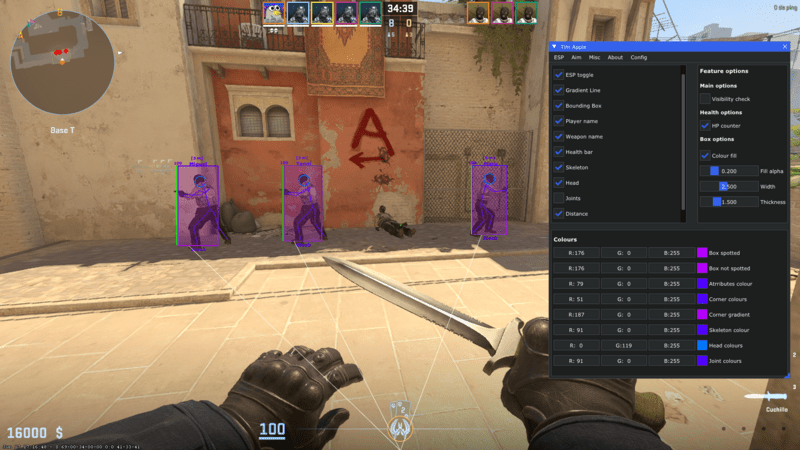

# :apple: Tim Apple
CS2 Semi External Cheat

## Compiling from source
Open `tim_apple.sln` in Visual Studio 2022, set build configuration to `Release | x64`.      
Press Build solution and you should receive `tim_apple.exe` file.      

## Usage #1
1. Run `tim_apple.exe` before opening Counter Strike 2.
2. Open Counter Strike 2.
3. Wait for everything to load.
4. Enjoy cheating!
## Usage #2
1. Open Counter Strike 2.
2. Run `tim_apple.exe` when CS2 is COMPLETELY LOADED.
3. Enjoy cheating!
### Controls
Press the `INSERT` key to toggle the menu.     
Press the `END` key to end the cheat.

## Offsets
### Script download
Run the `updateoffset.cmd` in the same folder as your executable is
### Manual download
1. Download [client.dll.json](https://github.com/a2x/cs2-dumper/tree/main/output/client.dll.json), [offsets.json](https://github.com/a2x/cs2-dumper/tree/main/output/offsets.json) and [buttons.json](https://github.com/a2x/cs2-dumper/tree/main/output/buttons.json) 
2. Place these files in the same folder as the executable file `tim_apple.exe` is    

## Features
*Most features have visibility check*
### ESP
- Health bar (+ HP counter)
- Player name
- Weapon icons / names
- Skeleton
- Joints
- Head
- Snap lines
- Distance
### Aim
- Aimbot (+ Player lock)
- Recoil control system
- Trigger bot (random click delay)
### Misc
- Bunny hop
- Anti flash
- Deathmatch Mode
- Dropped item ESP **(PERFORMANCE ISSUES)**

## FAQ
### How to use the weapon icon font file
1. Make a folder called `fonts` in the same folder as the executable is.
2. Add the file `weaponIcons.ttf` in the folder.
*(If the program cannot see the file, weapon names will be displayed instead)*

### Is this cheat read-only?
It can be if you use the features that don't write to the game's memory.     
Namely: All ESP, Bunny Hop, Aim Bot, RCS and Trigger Bot
I'll be working on try to make everything read-only (Anti-Flash aside because it's impossible to make it external)

## Credits
- [ocornut/imgui](https://github.com/ocornut/imgui)
- [nlohmann/json](https://github.com/nlohmann/json)
- [a2x/cs2-dumper](https://github.com/a2x/cs2-dumper)
- [kristofhracza/tim_apple](https://github.com/kristofhracza/tim_apple) (Original tim_apple)
